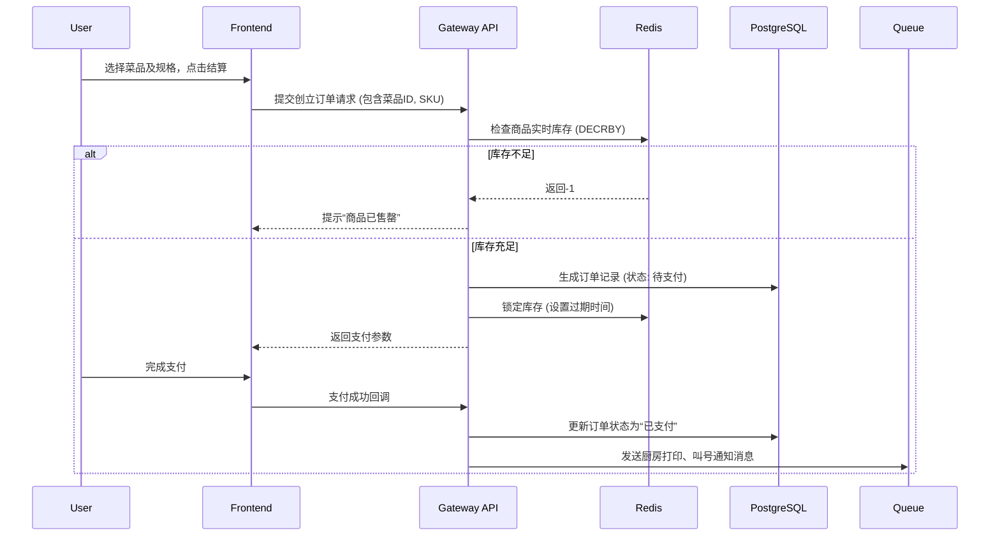

# 餐饮点菜系统开发总体方案

基于对 `chilachila.com/menu` 的深度调研与业务分析，为您规划这套对标且更具扩展性的点菜系统解决方案。本方案旨在打造一个体验流畅（Mobile-First）、支持高并发、且具备强大后台管理能力的餐饮SaaS化/独立部署的点单平台。

---

## 1. 产品核心定位与交互设计准则

*   **多店/多模式支持**：支持连锁多门店架构，支持“堂食扫码”、“外卖配送”和“到店自提”三种核心业务场景。
*   **极致的 C 端体验 (对标 Chilachila)**：
    *   **视觉驱动**：采用横向分类导航与纵向菜品列表结合的布局，左图右文，提供高质量菜品展示空间。
    *   **无缝定制**：点击菜品弹出“SKU定制弹窗”（如：辣度、加料、规格），必选项高亮提示，避免误操作。
    *   **悬浮购物车**：全局悬浮的底部结算条，实时显示总价与件数。
*   **响应式与跨平台**：采用移动端优先（Mobile-First）设计，通过微信小程序、H5（可嵌入公众号）双端触达用户。

---

## 2. 功能模块规划

### 2.1 C 端用户端 (微信小程序 / H5)
*   **门店与模式选择**：LBS 自动定位最近门店，选择堂食（扫桌码自动绑定）、外卖或自提。
*   **点单主页**：
    *   左侧/顶部滑动分类导航。
    *   动态菜品列表（支持售罄、休息中状态展示）。
    *   营销标签显示（如：店长推荐、限时特惠）。
*   **SKU 选择器**：单选（尺寸）、多选（加料）、选配（忌口）。
*   **购物车与结算**：订单汇总、就餐人数/备注填写、优惠券抵扣、微信/支付宝/Stripe(海外) 支付拉起。
*   **订单与会员中心**：实时订单状态追踪（排队中/制作中/请取餐）、历史订单、会员积分与等级。

### 2.2 B 端商户管理台 (Web PC端)
*   **概览数据看板**：今日营业额、实收客单价、热销菜品排行、实时接单数据。
*   **商品与菜单管理**：
    *   分类管理与菜品库建立。
    *   SKU/规格模板库（例如一套“饮品甜度/冰度”模板应用于所有奶茶）。
    *   动态上下架与库存沽清（一键售罄）。
*   **订单处理中心**：
    *   实时语音播报新订单。
    *   订单状态流转（接单 -> 厨房打印 -> 叫号/发货 -> 完成）。
    *   退款与异常订单处理。
*   **门店/桌码管理**：多门店信息配置、营业时间设置、生成对应桌台的聚合点餐二维码。
*   **营销与会员管理**：优惠券发放（立减、满减）、会员积分规则设置。

---

## 3. 技术架构设计

采用前后端分离架构，保证系统的高可用性、易扩展性和良好的开发维护体验。

### 3.1 技术栈选型
| 模块 | 技术栈推荐 | 优势说明 |
| :--- | :--- | :--- |
| **C端前端** | Taro / Uni-app (Vue/React) | 一套代码可同时编译为微信小程序和 Web H5，开发效率高。 |
| **B端前端** | React 18 / Next.js + Tailwind CSS | 丰富的组件库（如 Ant Design/Radix UI），适合构建复杂后台，Tailwind 提升样式开发速度。 |
| **后端 API** | Node.js (NestJS) 或 Go (Gin) | Node.js 适合全栈团队快速迭代；Go 则在处理高并发订单时性能卓越。推荐使用 TypeScript 配合 NestJS 保证企业级工程质量。 |
| **数据库** | PostgreSQL + Redis | PgSQL 提供强大的关系型数据存储与 JSON 字段支持（适合复杂的 SKU 属性）；Redis 用于购物车缓存、高并发减库存及分布式锁防超卖。 |
| **消息队列** | RabbitMQ / Redis Streams | 用于处理订单支付成功后的异步任务（如厨房打印机推单、派送短信通知）。 |

### 3.2 核心系统交互流 (下单防超卖逻辑)

---

## 4. 关键技术难点与解决方案

1.  **复杂 SKU 与价格计算**：
    *   **方案**：数据库设计采用 `Product(主商品)` -> `Product_SKU(具体规格组合)` -> `Product_Addon(可选加料)` 模型。前端购物车通过 `Hash(ProductID + 选项组合)` 作为唯一 Key，后端统一校验价格（防前端篡改）。
2.  **高并发下的防止超卖**：
    *   **方案**：下单时利用 Redis 的单线程原子性操作进行预减库存。若支付超时（如 15 分钟未支付），系统通过定时任务或延迟队列释放锁定的库存。
3.  **实时状态通讯 (如后厨接单通知)**：
    *   **方案**：B 端接单台使用 WebSocket (或 Server-Sent Events) 与服务端保持长连接，实现订单毫秒级推送和语音播报。

---

## 5. 实施路径规划

*   **Phase 1：MVP MVP 最小可行性产品 (约 3-4 周)**
    *   打通微信小程序/H5 核心点单与加购物车流程。
    *   基础 B 端后台（商品管理、查看订单）。
    *   集成基础支付能力。
*   **Phase 2：高级功能补充 (约 3 周)**
    *   复杂 SKU 与规格组支持。
    *   多门店切换与 LBS 定位。
    *   接入云打印机实现后厨自动出单。
*   **Phase 3：完善与运营赋能 (约 2-3 周)**
    *   数据统计看板。
    *   会员积分与营销发券系统。
    *   性能压测与防超卖优化。

> [!TIP]
> **后续步骤建议**
> 为了能够更贴合您的实际需求，请问：
> 1. 您目前首要开发的是**微信小程序**还是**海外使用的 Web/H5** 端？（涉及支付通道的选择不同，海外可能需 Stripe，国内走微信支付）
> 2. 您是否有现成的设计稿或需要我们进行高保真 UI 设计？
> 3. 您期望此系统的部署环境是云端 SaaS 模式，还是企业内网私有化部署？
